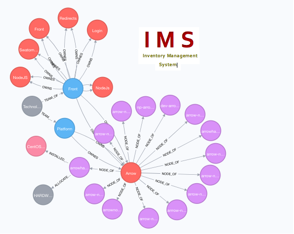

<p align="left">
  
</p>

# Inventory management system

This is graph based system, the purpose of this system is to track the inventory like.

1. Physical or virtual node/server details
2. Nodes/Servers to service/application associations
3. Node/Server to Hardware and installed operating system associations 
4. Team to Application/Service associations.

Since this is graph based application, all the components are well connected and it is easy to retrieve or traverse from any node.


## Domain Model:
```
 Nodes
 
 Department     : Departments in company ex: technology
 Team           : Team within department
 Application    : Application, could be a logical name to group of servers serving same purpose, ex: User Service 
 Server         : A Phisical/Victrual node, which hosts the one/many nodes of an application
 Hardware       : Hardware profile ( combination of Memory, CPU and Disk)
 OperatingSystem: Installed operating system 
 
 Relations
 
 ALLOCATED_HARDWARE  : Association between Server and Hardware
 INSTALLED_OS        : Installed OS relation between Server and OperatingSystem
 TEAM_OF             : Department to Team association
 OWNES               : Team to application association
 NODE_OF             : Application to Server association
 ```
## Application installation
This application is springboot application with embedded jetty container, this can be deployed in jetty container. 
```
1. Install neo4j (https://neo4j.com/docs/operations-manual/current/installation/)
2. Change neo4j server password 
   Ex: curl -H "Content-Type: application/json" -X POST -d '{"password":"blahblah"}' -u neo4j:neo4j http://localhost:7474/user/neo4j/password
3. Update neo4j configuration to enable http and bolt ports
   Add below 3 lines at the bottom of the file {NEO4J_HOME}/conf/neo4j.conf
   dbms.connector.http.address=0.0.0.0:7474
   dbms.connector.https.address=0.0.0.0:7473
   dbms.connector.bolt.address=0.0.0.0:7687
3. Update the connection information under "application.properties" to connect to neo4j instance
   spring.data.neo4j.uri=bolt://host:7687
   spring.data.neo4j.username=neo4j
   spring.data.neo4j.password=blahblah

4. Java8
5. Maven3
 ```

### API's

#### Get All Teams
```
http://host:7001/nventory/v1/teams
ex: http://localhost:7001/nventory/v1/teams
```
### Get Team by name
```
http://host:7001/nventory/v1/teams/{teamName}
ex: http://localhost:7001/nventory/v1/teams/Platform
```

#### Get All Applications by team
```
http://host:7001/nventory/v1/teams/{teamName}/applications
ex: http://host:7001/nventory/v1/teams/Platform/applications
```

#### Get Application by appName
```
http://host:7001/nventory/v1/applications/{appName}
ex: http://host:7001/nventory/v1/applications/Arrow
```

#### Get All Servers by appName
```
http://localhost:7001/nventory/v1/teams/applications/{appName}/servers
ex: http://localhost:7001/nventory/v1/teams/applications/Arrow/servers
```

### Get all resources by team
```
http://localhost:7001/nventory/v1/teams/{teamName}/applications/resources
Ex: http://localhost:7001/nventory/v1/teams/Platform/applications/resources
```

### Load data using file
```
Path: http://host:port/nventory/v1/servers/file/{fileName}
Ex: curl -X POST http://localhost:7001/nventory/v1/servers/file/inventory-load-2017-Part1.xlsx
```

### How to change password on default neo4j instance
```
curl -H "Content-Type: application/json" -X POST -d '{"password":"your new password"}' -u neo4j:neo4j http://localhost:7474/user/neo4j/password
```


### Update cost
```
curl -X POST http://localhost:7001/nventory/v1/applications/Arrow/costByServer/3.5
```

 
## Sample Queries


### Get Team by name
```
Match(n:Team{name:'Front'}) return n
```

### Get Application by name
```
Match(n:Application{name:'Front'}) return n
```

### Get Allocated Memory By Application
```
Match(n:Application{name:'Arrow'})-[no: NODE_OF]-()-[r: ALLOCATED_HARDWARE]-(h: Hardware) return sum(h.memoryInGB)
```

### Get Allocated CPU By Application
```
Match(n:Application{name:'Arrow'})-[no: NODE_OF]-()-[r: ALLOCATED_HARDWARE]-(h: Hardware) return sum(h.numberOfCores)
```

### Get Allocated DiskSpace By Application
```
Match(n:Application{name:'Arrow'})-[no: NODE_OF]-()-[r: ALLOCATED_HARDWARE]-(h: Hardware) return sum(h.allocatedSpaceInGB)
```

### Number of allocated processes by application
```
Match(a:Application {name: 'Arrow'})-[NODE_OF]-(n:Server)--[r: ALLOCATED_HARDWARE]-(h: Hardware) return a, h
```
